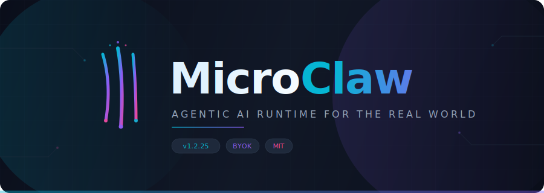
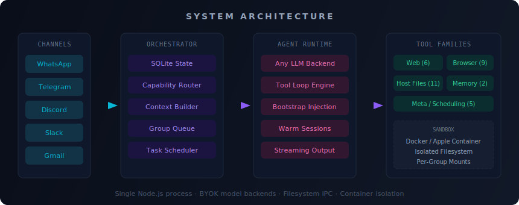

<p align="center">
  
</p>

<p align="center">
  <strong>Your AI agent that actually does things.</strong><br>
  Multi-channel, multi-model, self-hosted runtime with 33+ tools, browser automation, and host file control.
</p>

<p align="center">
  <a href="#-quick-start"></a>&nbsp;
  <a href="#-tool-families"></a>&nbsp;
  <a href="#-bring-your-own-model"></a>&nbsp;
  <a href="https://github.com/rithwik1510/MicroClaw/blob/main/LICENSE"></a>
</p>

---

## What is MicroClaw?

MicroClaw is a **self-hosted AI agent runtime** that connects to your messaging apps and actually gets work done — browsing the web, managing files on your computer, searching the internet, scheduling tasks, and remembering context across conversations.

It's not a chatbot wrapper. It's an execution engine with **33+ tools** across 6 families, running in sandboxed containers with full isolation.

What makes it different:

- **Bring Your Own Key** — use any OpenAI-compatible model (Ollama, LM Studio, DeepInfra, OpenRouter, or Claude)
- **Host file operations** — your agent can read, write, move, and organize files on your actual computer
- **Smarter routing** — capability-aware routing that picks the right tools for each message
- **Local model reliability** — bootstrap injection and contract enforcement that make 7-13B models actually work with tools
- **Warm sessions** — conversation state persists across turns for natural multi-step workflows

---

## How MicroClaw Is Better

MicroClaw started from an open-source assistant foundation and rebuilt the parts that matter for real-world agentic execution.

| Area | Base Foundation | MicroClaw |
|---|---|---|
| **Model support** | Claude API only | Any OpenAI-compatible endpoint — Ollama, LM Studio, DeepInfra, OpenRouter, Claude |
| **Runtime routing** | Basic profile compatibility | Capability-aware router with 5 intent routes and automatic tool selection |
| **Host file access** | None | 11 host-file tools including `exec_host_command` for shell operations on your machine |
| **Local model reliability** | Not designed for small models | Bootstrap injection + contract enforcement — makes 7B models use tools correctly |
| **Tool ecosystem** | Core tools only | 33+ tools across 6 families (web, browser, files, memory, scheduling, meta) |
| **Browser operations** | Limited interaction | Full Playwright stack — login, click, type, screenshot, extract, multi-tab |
| **Context pipeline** | General continuity | Layered context builder with memory retrieval, soft/hard caps, per-layer budgets |
| **Session handling** | Stateless turns | Warm sessions with conversation state persisting across turns |
| **Execution control** | Core container loop | Cleaner host/runner split, streaming output, IPC-based communication |
| **Operational tooling** | Core setup | CLI command center for onboarding, health checks, diagnostics, and control |

---

## Why MicroClaw?

| Feature | Typical AI Chatbot | MicroClaw |
|---|---|---|
| **Model lock-in** | One provider | Any OpenAI-compatible endpoint |
| **Tool use** | Text generation only | 33+ tools: web, browser, files, memory, scheduling |
| **File access** | None | Read, write, move, execute shell commands on your machine |
| **Browser** | None | Full Playwright automation: click, type, screenshot, extract |
| **Channels** | Web UI only | WhatsApp, Telegram, Discord, Slack, Gmail |
| **Memory** | Per-session | Persistent cross-session memory with search |
| **Isolation** | Shared process | Docker/Apple Container sandbox per group |
| **Self-hosted** | Cloud dependency | Runs on your machine, your data stays local |

---

## Quick Start

```bash
git clone https://github.com/rithwik1510/MicroClaw.git
cd MicroClaw
npm install
npm --prefix container/agent-runner install
```

Then set up your model and channels:

```bash
# Copy the example env and configure your model endpoint
cp .env.example .env

# Start in dev mode
npm run dev
```

### With Claude Code (recommended)

```bash
gh repo fork rithwik1510/MicroClaw --clone
cd MicroClaw
claude
```

Then type `/setup` — Claude Code handles dependencies, authentication, container setup, and service configuration automatically.

> **Note:** Commands prefixed with `/` (like `/setup`, `/add-whatsapp`) are [Claude Code skills](https://code.claude.com/docs/en/skills). Type them inside the `claude` CLI prompt, not in your terminal.

---

## Bring Your Own Model

MicroClaw works with **any OpenAI-compatible API endpoint**. Set these in your `.env`:

```bash
# Local models (Ollama, LM Studio)
OPENAI_COMPAT_BASE_URL=http://localhost:11434/v1
OPENAI_API_KEY=ollama
NANOCLAW_DEFAULT_MODEL=qwen2.5:14b

# Cloud providers (DeepInfra, OpenRouter, Together, etc.)
OPENAI_COMPAT_BASE_URL=https://api.deepinfra.com/v1/openai
OPENAI_API_KEY=your-key-here
NANOCLAW_DEFAULT_MODEL=meta-llama/Llama-3.3-70B-Instruct

# Or use Claude directly
NANOCLAW_DEFAULT_PROVIDER=claude
ANTHROPIC_API_KEY=your-key-here
```

### Tested with:
- **Ollama** — Qwen 2.5, Llama 3.3, Mistral, DeepSeek
- **LM Studio** — Any GGUF model with tool calling
- **DeepInfra** — Llama 3.3 70B, Qwen 2.5 72B
- **OpenRouter** — Any supported model
- **Claude** — Sonnet, Opus, Haiku

---

## Channels

Talk to your agent from anywhere. Each channel is added via a skill and self-registers at startup.

| Channel | Add with | Status |
|---|---|---|
| **WhatsApp** | `/add-whatsapp` | Pairing code auth, voice transcription ready |
| **Telegram** | `/add-telegram` | Bot API, Markdown formatting, group threads |
| **Discord** | `/add-discord` | Multi-guild, message splitting, streaming |
| **Slack** | `/add-slack` | Workspace integration |
| **Gmail** | `/add-gmail` | Email processing |

Run one channel or all five simultaneously. Each group gets isolated context, filesystem, and memory.

---

## Tool Families

MicroClaw agents have access to **33+ tools** organized into 6 families. The capability router automatically selects the right tools based on what the user is asking.

### Web Tools (6)
Search the internet and fetch content.

| Tool | Purpose |
|---|---|
| `web_search` | Search with structured results |
| `web_fetch` | Fetch specific URL content |
| `web_open_url` | Open URL in managed session |
| `web_extract_text` | Extract readable text from page |
| `web_get_links` | List links from current page |
| `web_close` | Close web session |

### Browser Tools (9)
Full Playwright-powered browser automation.

| Tool | Purpose |
|---|---|
| `browser_open_url` | Start managed browser session |
| `browser_snapshot` | Capture page with stable element refs |
| `browser_click` | Click element by ref |
| `browser_type` | Type text into form fields |
| `browser_select` | Select dropdown values |
| `browser_extract_text` | Get readable text content |
| `browser_screenshot` | Visual capture for debugging |
| `browser_tabs` | Manage browser tabs |
| `browser_close` | End browser session |

### Host File Tools (11)
Read, write, and manage files on the user's actual computer.

| Tool | Purpose |
|---|---|
| `exec_host_command` | Run shell commands (mv, cp, find, grep, etc.) |
| `read_host_file` | Read file content |
| `write_host_file` | Create or overwrite files |
| `edit_host_file` | Find-and-replace in files |
| `list_host_directories` | See allowed directories |
| `list_host_entries` | Browse directory contents |
| `glob_host_files` | Pattern matching search |
| `grep_host_files` | Text search across files |
| `make_host_directory` | Create directories |
| `move_host_path` | Move/rename files and folders |
| `copy_host_path` | Copy files recursively |

> Host file operations are sandboxed — the agent can only access directories you explicitly allow. `exec_host_command` runs bash commands inside allowed directories, making it reliable even with small local models.

### Memory Tools (2)
Persistent memory that survives across sessions.

| Tool | Purpose |
|---|---|
| `remember_this` | Save durable facts (preferences, project notes, todos) |
| `memory_search` | Query long-term memory with full-text search |

### Scheduling Tools (5)
Schedule tasks that run autonomously and message you back.

| Tool | Purpose |
|---|---|
| `schedule_task` | General scheduling (once/cron/interval) |
| `schedule_once_task` | One-time future execution |
| `schedule_recurring_task` | Calendar-based recurring tasks |
| `schedule_interval_task` | Elapsed-time repeating tasks |
| `register_watch` | Heartbeat monitoring and reminders |

---

## Architecture

<p align="center">
  
</p>

```
Message in → Channel Registry → SQLite Queue → Capability Router
  → Context Builder → Agent Runtime (any LLM) → Tool Loop → Sandboxed Execution
  → Response out
```

**Single Node.js process.** Channels self-register at startup. Messages queue per-group with concurrency control. The capability router decides which tools to expose based on intent detection. Agents execute in isolated containers (Docker or Apple Container) with only mounted directories accessible. IPC via filesystem.

### Capability Routes

The router analyzes each message and selects the optimal execution path:

| Route | Triggers on | Tools exposed |
|---|---|---|
| `host_file_operation` | "move my files", "organize desktop", explicit paths | Host files + memory |
| `browser_operation` | "log into", "click", "fill form", "book on" | Browser + memory |
| `web_lookup` | "search for", "latest news", "what's the price of" | Web + memory |
| `plain_response` | General conversation, questions, explanations | Memory only |
| `deny_or_escalate` | "scrape all", "control my computer" | Blocked |

### Key Innovation: Bootstrap Injection

Small local models (7-13B) struggle with multi-step tool chains. MicroClaw solves this with the **bootstrap pattern**:

1. Before the model sees the prompt, discovery is auto-executed and injected
2. The discovery tool is removed from the tool list — the model can't loop on it
3. `tool_choice: 'required'` forces the model to call an action tool
4. Contract enforcement ensures the model actually completes the task

This makes a 7B model reliably execute file operations that would normally require a 70B+ model.

---

## Key Files

| File | Purpose |
|---|---|
| `src/index.ts` | Orchestrator: state, message loop, agent invocation |
| `src/channels/registry.ts` | Channel registry (self-registration at startup) |
| `src/runtime/capability-router.ts` | Intent detection and route selection |
| `src/context/builder.ts` | Layered context pipeline with memory retrieval |
| `src/container-runner.ts` | Spawns streaming agent containers |
| `src/task-scheduler.ts` | Runs scheduled tasks |
| `src/db.ts` | SQLite operations (messages, groups, sessions, state) |
| `src/continuity.ts` | Conversation state and warm sessions |
| `container/agent-runner/` | In-container runtime: tool loop, streaming, LLM adapter |
| `container/agent-runner/src/tools/` | Tool implementations (web, browser, host-files, memory) |
| `groups/*/CLAUDE.md` | Per-group memory (isolated) |

---

## Features at a Glance

- **Multi-channel messaging** — WhatsApp, Telegram, Discord, Slack, Gmail. Run one or all.
- **Any model backend** — Ollama, LM Studio, DeepInfra, OpenRouter, Claude, or any OpenAI-compatible API.
- **33+ tools** — Web search, browser automation, host file management, persistent memory, task scheduling.
- **Host file control** — Your agent manages files on your computer via sandboxed shell commands.
- **Browser automation** — Full Playwright-powered browsing: login, fill forms, click buttons, screenshot.
- **Persistent memory** — Cross-session memory with full-text search. Your agent remembers.
- **Scheduled tasks** — Cron jobs, one-time tasks, interval repeats, heartbeat monitoring.
- **Container isolation** — Every group runs in its own Docker/Apple Container sandbox.
- **Per-group context** — Isolated filesystem, memory, and conversation history per group.
- **Warm sessions** — Conversation state persists across turns for natural workflows.
- **Capability routing** — Automatic tool selection based on message intent.
- **Local model optimized** — Bootstrap injection makes small models reliable with tools.
- **Sender allowlists** — Per-chat access control for who can talk to your agent.
- **Voice transcription** — Whisper integration for voice messages.
- **Image vision** — Process images sent through messaging channels.
- **PDF reading** — Extract and process PDF content.
- **Agent swarms** — Spin up teams of specialized agents for complex tasks.
- **Self-hosted** — Your data stays on your machine. No cloud dependency.

---

## Skills

MicroClaw uses a skill system for extensibility. Skills are Claude Code commands that add capabilities.

### Channel Skills
| Skill | Description |
|---|---|
| `/add-whatsapp` | WhatsApp via pairing code auth |
| `/add-telegram` | Telegram bot integration |
| `/add-discord` | Discord multi-guild support |
| `/add-slack` | Slack workspace integration |
| `/add-gmail` | Gmail email processing |

### Enhancement Skills
| Skill | Description |
|---|---|
| `/add-host-files` | Enable host file access for your agent |
| `/add-voice-transcription` | Whisper-based voice message transcription |
| `/add-image-vision` | Image processing for messaging channels |
| `/add-pdf-reader` | PDF content extraction |
| `/add-reactions` | Emoji reactions and status tracking |
| `/add-ollama-tool` | Local model inference via Ollama |

### System Skills
| Skill | Description |
|---|---|
| `/setup` | First-time installation and configuration |
| `/customize` | Modify behavior, add integrations |
| `/update` | Pull upstream updates |
| `/claw` | CLI utility for common operations |

---

## FAQ

**Can I use open-source models?**

Yes — that's the whole point. Set `OPENAI_COMPAT_BASE_URL` to your Ollama/LM Studio endpoint and pick your model. MicroClaw's bootstrap injection and contract enforcement are specifically designed to make small local models work reliably with tools.

**Why Docker?**

Docker provides cross-platform container isolation. Agents run inside containers with only explicitly mounted directories accessible. On macOS, you can switch to Apple Container via `/convert-to-apple-container` for a lighter native runtime.

**Can I run this on Windows?**

Yes, via WSL2 + Docker Desktop. The orchestrator runs natively on Node.js, and containers run in WSL2.

**Is this secure?**

Agents run in containers, not behind application-level permission checks. They can only access explicitly mounted directories. Host file operations are sandboxed to directories you allow. See [docs/SECURITY.md](docs/SECURITY.md) for the full security model.

**Can I still use Claude?**

Absolutely. Set `NANOCLAW_DEFAULT_PROVIDER=claude` and add your API key. MicroClaw supports Claude natively alongside any OpenAI-compatible endpoint.

---

## Development

```bash
npm run dev          # Run with hot reload
npm run build        # Compile TypeScript
npm test             # Run test suite
npm run gate         # Full validation (typecheck + test + build)
npm run lint         # ESLint
```

Container rebuild:
```bash
./container/build.sh
```

---

## Contributing

See [CONTRIBUTING.md](CONTRIBUTING.md) for guidelines on accepted changes, skill types, PR requirements, and the pre-submission checklist.

---

## License

[MIT](LICENSE) — Use it, fork it, ship it.

<p align="center">
  <sub>Built with late nights, too much coffee, and the belief that AI agents should actually do things.</sub>
</p>
